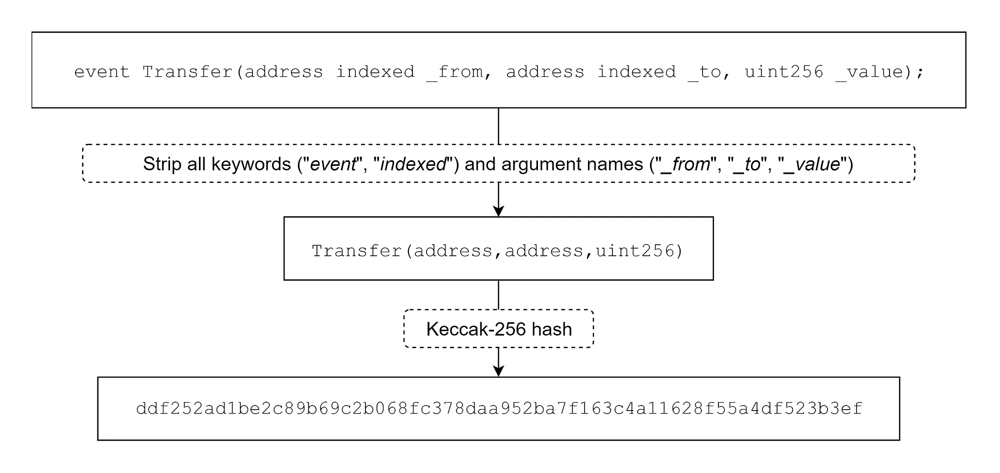

# Dune.com (Cheat Sheet)

This is a cheatsheet for dune.com commands and patterns (mostly notes-to-self). They are incomplete by default.

## Background

### Ethereum logs

Source: [medium.com][1]

The EVM currently has **5 opcodes** for emitting event logs: 
`LOG0`, `LOG1`, `LOG2`, `LOG3`, and `LOG4`.

Each log record consists of both **topics** and **data**. 

**Topics** are 32-byte (256 bit) "words" that are used to describe what's going on in an event.

Different opcodes (`LOG0` ... `LOG4`) are needed to describe the number of topics 
that need to be included in the log record. For instance, **LOG1** includes **one topic**, while **LOG4** includes **four topics**. Therefore, the maximum number of topics that can be 
included in a single log record is **four**.

#### Topics

The first part of a log record consists of an array of topics. These topics are used to describe 
the event. 

The first topic (`topic0`) usually consists of the ***signature*** 
(a [keccak256][2] hash) of the name of the event that occurred, including the types 
*(`uint256`, `string`, etc.)* of its parameters. 



One exception where this signature is not included as the first topic is when emitting 
**anonymous events**. 

Since topics can only hold a maximum of 32 bytes of data, things like arrays or strings cannot be 
used as topics reliably. Instead, they should be included as **data** in the log record, 
not as a **topic**. 

If you try to include a topic larger than 32 bytes, the topic will be hashed instead. 
As a result, this hash can only be reversed if you know the original input. 
Thus, topics should **only** reliably be used for data that strongly narrows down search queries 
(like addresses). Topics can be seen as indexed *keys* of the event that all map to the same value.

#### Data

While topics are searchable, data is not. But, including data is **a lot cheaper** than 
including topics. Similarly, topics are limited to **32 bytes**, event data is not, which means 
it can include **large or complicated data** like arrays or strings. 

By analogy, if **topics** are _keys_, then **data** is the _value_.

[1]: https://medium.com/mycrypto/understanding-event-logs-on-the-ethereum-blockchain-f4ae7ba50378
[2]: https://en.wikipedia.org/wiki/SHA-3

### Bytes, hex characters, solidity data types

In Ethereum, 1 byte = 2 hexadecimal characters.
Therefore, a 32-byte word is represented by 64 hexadecimal characters.


| Solidity data type  | Size (Bytes) | Size (Hex Characters) | Notes                                                   |
|----------------|--------------|-----------------------|---------------------------------------------------------|
| `address`      | 20           | 40                    | Ethereum addresses are 20 bytes long.                   |
| `uint256`      | 32           | 64                    | Unsigned integer of 256 bits.                           |
| `bool`         | 1            | 2                     | Boolean values are typically padded to 32 bytes.        |
| `bytes1` to `bytes32` | 1 to 32  | 2 to 64              | Fixed-size byte arrays.                                 |
| `int256`       | 32           | 64                    | Signed integer of 256 bits.                             |
| `string`       | Variable     | Variable              | Dynamic size. Encoded with length prefix in `data`.     |
| `bytes`        | Variable     | Variable              | Similar to `string`, dynamic size.                      |
| `enum`         | Variable     | Variable              | Depends on the number of elements (often 1 to 32 bytes).|


## Parse `uint256` from `data`

For example, suppose `data` is: 

```txt
0x0000000000000000000000000000000000000000000000a2a15d09519be00000000000000000000000000000000002e93c1c6586656bb97761036c475599e3d0
```

where `data` is the concatenation of `uint256 value` and `uint256 units`, in the following event:

```solidity
event ValidatorGroupVoteActivated(
    address indexed account,
    address indexed group,
    uint256 value,
    uint256 units
);
```

We know that 1 byte is 2 hex characters, and the data type `uint256` requires 32 bytes or 64 
hex characters. On that basis, we can use the 
[`bytearray_substring(varbinary, integer, integer) → varbinary`][3]
function to parse `value` and `units` from `data`:

```sql
SELECT 
    -- ...
    bytearray_substring(data, 1, 32) as value, -- uint256 = 32 bytes = 64 hex characters
    bytearray_substring(data, 33, 64) as units -- uint256 = 32 bytes = 64 hex characters
    -- ...
FROM celo.logs
WHERE contract_address = 0x8d6677192144292870907e3fa8a5527fe55a7ff6 -- ElectionProxy
    AND topic0 = 0x45aac85f38083b18efe2d441a65b9c1ae177c78307cb5a5d4aec8f7dbcaeabfe -- ValidatorGroupVoteActivated
```

This returns:

```txt
value = 0x0000000000000000000000000000000000000000000000a2a15d09519be00000
units = 0x000000000000000000000000000002e93c1c6586656bb97761036c475599e3d0
```

> **FOOTNOTE**
> Unfortunately, in dune you need to ignore `0x` in `data`, which is the first byte, 
> so the indices are shifted by 1. See dune docs for 
> [`bytearray_substring(varbinary, integer, integer) → varbinary`][3].
> 
> ```sql
> SELECT 0xabcdefabcdef AS varbinary_data,
>        bytearray_substring(0xabcdefabcdef, 1, 3) AS varbinary_substring
> -- returns  0xabcd
> ```


Now convert `value` and `unit` (which are `varbinary` words)  to `uint256` using [`bytearray_to_uint256(varbinary) → uint256`][4]:

```sql
SELECT 
    -- ...
    bytearray_to_uint256(bytearray_substring(data, 1, 32)) as value, -- uint256 = 32 bytes = 64 hex characters
    bytearray_to_uint256(bytearray_substring(data, 33, 64)) as units -- uint256 = 32 bytes = 64 hex characters
    -- ...
FROM celo.logs
WHERE contract_address = 0x8d6677192144292870907e3fa8a5527fe55a7ff6 -- ElectionProxy
    AND topic0 = 0x45aac85f38083b18efe2d441a65b9c1ae177c78307cb5a5d4aec8f7dbcaeabfe -- ValidatorGroupVoteActivated
```

This returns: 

```txt
value = 3000000000000000000000
units = 253590264479329621170386650913407566996432
```

[3]: https://dune.com/docs/query/DuneSQL-reference/Functions-and-operators/varbinary/#byte-array-manipulation-functions
[4]: https://dune.com/docs/query/DuneSQL-reference/Functions-and-operators/varbinary/#bytearray_to_uint256

### Remove leading zeros from `address`

For example, suppose `topic1` is: 

```txt
0x000000000000000000000000da5fc5db514ffe24f30229711fc4545624e52320
```

where `topic1` is `address account`, in the following event:

```solidity
event ValidatorGroupVoteActivated(
    address indexed account,
    address indexed group,
    uint256 value,
    uint256 units
);
```

We can use [`bytearray_ltrim(varbinary) → varbinary`][5] to remove leading zeros from `topic1`:

```sql
SELECT 
    -- ...
    bytearray_ltrim(topic1) as account,
    -- ...
FROM celo.logs
WHERE contract_address = 0x8d6677192144292870907e3fa8a5527fe55a7ff6 -- ElectionProxy
    AND topic0 = 0x45aac85f38083b18efe2d441a65b9c1ae177c78307cb5a5d4aec8f7dbcaeabfe -- ValidatorGroupVoteActivated
```

This returns:

```txt
account = 0xda5fc5db514ffe24f30229711fc4545624e52320
```

[5]: https://dune.com/docs/query/DuneSQL-reference/Functions-and-operators/varbinary/#bytearray_ltrim

### Convert wei to ethers

```sql
SELECT 
    (value * 1e-18) as amountInDollar -- converts to decimal (10^18 wei = 1 ether)
FROM erc20_celo.evt_Transfer
WHERE contract_address = 0x765de816845861e75a25fca122bb6898b8b1282a -- cUSD ERC-20 token 
```

## Date and Time

### Getting year, month, day from timestamp

`year()`: Returns the year from x.
`month()`: Returns the month of the year from x.

Source: 
[dune.com](https://dune.com/docs/query/DuneSQL-reference/Functions-and-operators/datetime/?h=year#year)

Example of hacky way I needed to get `2023_09` type `varchar`:

```sql
CONCAT(CAST(year(time) as varchar), '-', cast(month(time) as varchar)) as year_month,
```

